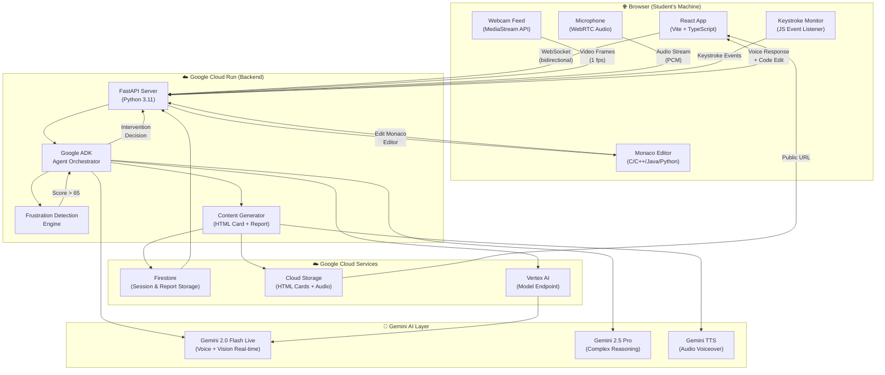

# 🏗️ Architecture Document
## SAGE — Empathetic AI Pair Tutor
**Version:** 1.0 | **Date:** 2026-03-01 | **Status:** Approved

---

## 1. System Overview

SAGE is a three-layer system: a **React frontend** (browser), a **Python FastAPI backend** (Google Cloud Run), and the **Google AI/Cloud services layer**. The Gemini Live API forms the real-time multimodal backbone, while ADK (Agent Development Kit) orchestrates agent behavior.

---

## 2. High-Level Architecture Diagram



---

## 3. Component Architecture

### 3.1 Frontend Components
```
src/
├── App.tsx                     # Root app, session state
├── components/
│   ├── SageAvatar/             # Animated AI avatar with speaking state
│   ├── MonacoEditor/           # Code editor with SAGE control overlay
│   ├── SessionControls/        # Start/Stop session, language selector
│   ├── FrustrationMeter/       # Real-time confidence score visualization
│   ├── VoiceIndicator/         # Speaking/listening state indicator
│   └── Dashboard/              # Lesson history and reports
├── hooks/
│   ├── useWebRTC.ts            # Camera/mic stream management
│   ├── useWebSocket.ts         # Backend connection and message handling
│   ├── useKeystrokeMonitor.ts  # Typing activity tracker
│   └── useSageSession.ts       # Orchestrates full session lifecycle
└── pages/
    ├── Session.tsx              # Main tutoring session page
    ├── Dashboard.tsx            # Student progress dashboard
    └── LearningCard.tsx         # View generated HTML learning card
```

### 3.2 Backend Components
```
backend/
├── main.py                      # FastAPI app entry point
├── agents/
│   ├── sage_agent.py            # ADK Agent definition (tools, instructions)
│   ├── tools/
│   │   ├── edit_code.py         # Tool: modify Monaco editor content
│   │   ├── highlight_line.py    # Tool: highlight specific code lines
│   │   ├── explain_concept.py   # Tool: trigger explanation flow
│   │   └── generate_card.py     # Tool: create HTML learning card
├── services/
│   ├── frustration_engine.py    # Weighted score calculator
│   ├── gemini_live.py           # Gemini Live API session manager
│   ├── content_generator.py     # HTML card + lesson report builder
│   ├── firestore_service.py     # Firestore CRUD operations
│   └── storage_service.py       # Cloud Storage upload/URL generation
├── models/
│   ├── session.py               # Pydantic models for session data
│   ├── frustration.py           # Frustration signal models
│   └── report.py                # Lesson report models
└── infra/                       # Terraform files
    ├── main.tf
    ├── variables.tf
    └── outputs.tf
```

---

## 4. Frustration Detection Engine (Core Algorithm)

```
┌─────────────────────────────────────────────────────┐
│              FRUSTRATION DETECTION ENGINE            │
├─────────────────────────────────────────────────────┤
│                                                     │
│  Signal A: CAMERA (Weight: 40%)                     │
│  ┌─────────────────────────────────┐                │
│  │ Gemini Vision analyzes 1fps feed│                │
│  │ • Furrowed brow      → 40pts   │                │
│  │ • Head scratch        → 35pts   │                │
│  │ • Looking away 3s+    → 30pts   │                │
│  │ • Face not visible    → 15pts   │                │
│  └─────────────────────────────────┘                │
│                                                     │
│  Signal B: SILENCE (Weight: 30%)                    │
│  ┌─────────────────────────────────┐                │
│  │ Keystroke gap monitoring        │                │
│  │ • 0–15s gap           → 0pts    │                │
│  │ • 15–30s gap          → 15pts   │                │
│  │ • 30–60s gap          → 25pts   │                │
│  │ • 60s+ gap            → 30pts   │                │
│  └─────────────────────────────────┘                │
│                                                     │
│  Signal C: VOICE (Weight: 30%)                      │
│  ┌─────────────────────────────────┐                │
│  │ Gemini Live audio analysis      │                │
│  │ • Audible sigh         → 30pts  │                │
│  │ • "Ugh/hmm/ugh"        → 25pts  │                │
│  │ • Long silence (voice) → 20pts  │                │
│  │ • Repeated question    → 28pts  │                │
│  └─────────────────────────────────┘                │
│                                                     │
│  COMPOSITE SCORE = (A×0.4) + (B×0.3) + (C×0.3)    │
│                                                     │
│  Score > 65 → SAGE INTERRUPTS                       │
│  "Hey, you've been on this for a while —            │
│   want me to walk you through it?"                  │
│                                                     │
└─────────────────────────────────────────────────────┘
```

---

## 5. Gemini Live API Integration

```
CLIENT (Browser)          BACKEND (FastAPI)         GEMINI LIVE API
     │                          │                          │
     │──── WebSocket Open ──────►│                          │
     │                          │──── Open Live Session ──►│
     │                          │◄─── Session Ready ───────│
     │──── Audio PCM (16kHz) ──►│──── Forward Audio ──────►│
     │──── Video Frame (1fps) ──►│──── Forward Video ──────►│
     │                          │◄─── Text Analysis ───────│
     │                          │◄─── Audio Response ──────│
     │◄─── Voice Response ──────│                          │
     │◄─── Code Edit Command ───│                          │
     │                          │                          │
     [Student interrupts]        │                          │
     │──── Interrupt Signal ───►│──── Send Interrupt ─────►│
     │                          │◄─── SAGE stops speaking ─│
```

---

## 6. Data Flow: End-of-Session Content Generation

```
Session Ends
     │
     ▼
Gemini 2.5 Pro (via Vertex AI)
"Analyze this session transcript and code history.
 Generate: concept explanation, key mistake analysis,
 corrected code with annotations, 3 next-step topics."
     │
     ├──► TEXT CONTENT (explanation + lesson report JSON)
     │
     ├──► HTML LEARNING CARD TEMPLATE filled with content
     │         + CSS animations for concept diagrams
     │
     ├──► GEMINI TTS: audio voiceover of card summary
     │
     ├──► FILES uploaded to Cloud Storage
     │         HTML Card → public URL generated
     │         Audio file → embedded in card
     │
     └──► FIRESTORE: lesson report document saved
               → appears in student dashboard
```

---

## 7. Security Architecture

| Layer | Mechanism |
|---|---|
| API Authentication | Session tokens (UUID, stateless for hackathon) |
| Camera/Mic Data | Never persisted — streamed directly to Gemini |
| Gemini API Key | Stored in GCP Secret Manager |
| Cloud Storage | HTML cards: public read, private write |
| Firestore | Rules: user can only read their own session data |
| CORS | Backend restricted to frontend domain only |

---

## 8. Deployment Architecture

```
                    ┌─────────────────┐
                    │  Cloud DNS /    │
                    │  Load Balancer  │
                    └────────┬────────┘
                             │
              ┌──────────────┴──────────────┐
              │                             │
    ┌─────────▼──────────┐       ┌──────────▼──────────┐
    │  Cloud Run         │       │  Cloud Storage       │
    │  Frontend (React)  │       │  (Static HTML Cards) │
    │  Port: 8080        │       │  (Audio Files)       │
    └─────────┬──────────┘       └─────────────────────┘
              │
    ┌─────────▼──────────┐
    │  Cloud Run         │
    │  Backend (FastAPI) │
    │  Port: 8080        │
    └─────────┬──────────┘
              │
    ┌─────────▼──────────┐
    │  Firestore         │
    │  (Native Mode)     │
    └────────────────────┘
```
