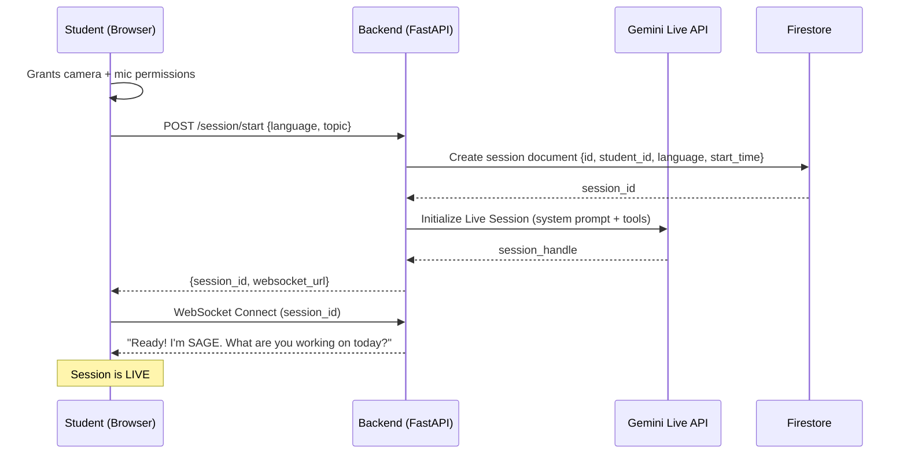

# 🔄 Application Flow Document
## SAGE — Empathetic AI Pair Tutor
**Version:** 1.0 | **Date:** 2026-03-01

---

## 1. Master User Journey

```
[Student opens browser]
        │
        ▼
[Landing Page]
"Meet SAGE, your AI tutor"
[Start Session Button]
        │
        ▼
[Permission Request]
• Allow Camera ✓
• Allow Microphone ✓
        │
        ▼
[Session Setup Screen]
• Select Language: C / C++ / Java / Python
• Topic (optional): "I'm working on Linked Lists"
• Click "Start Session with SAGE"
        │
        ▼
[ACTIVE TUTORING SESSION]
        │
        ├──► [Student codes in Monaco Editor]
        ├──► [Student talks to SAGE freely]
        ├──► [SAGE listens + watches continuously]
        │
        ├──► [FRUSTRATION DETECTED?]
        │         └──► YES → [SAGE Intervention Flow]
        │         └──► NO  → [Continue monitoring]
        │
        ├──► [Student asks SAGE a direct question?]
        │         └──► YES → [SAGE answers immediately]
        │
        └──► [Student says "End session" or clicks Stop]
                    │
                    ▼
            [END-OF-SESSION FLOW]
                    │
                    ▼
            [HTML Learning Card + Lesson Report Generated]
                    │
                    ▼
            [Student Dashboard]
```

---

## 2. Session Startup Flow



---

## 3. Continuous Monitoring Loop (Every 5 Seconds)

```
MONITORING TICK (every 5 seconds during active session)
│
├── COLLECT SIGNALS
│   ├── Camera: Capture current video frame (1 frame/5s sent to Gemini Vision)
│   ├── Silence: Calculate seconds since last keystroke
│   └── Voice: Gemini Live audio analysis runs continuously (not on tick)
│
├── CALCULATE FRUSTRATION SCORE
│   ├── Camera Score  = Gemini Vision response (0–100) × 0.40
│   ├── Silence Score = f(seconds_since_keystroke)   × 0.30
│   └── Voice Score   = Gemini Live emotion signal   × 0.30
│   └── TOTAL = sum of above (0–100)
│
├── DECISION
│   ├── Score < 40:  Normal → No action, continue
│   ├── Score 40–65: Cautious → Log elevated state, watch closely
│   └── Score > 65:  FRUSTRATED → Trigger SAGE Intervention
│
└── LOG to Firestore (frustration_log collection, every 30s)
```

---

## 4. SAGE Intervention Flow (The Core WOW Feature)

```
FRUSTRATION THRESHOLD CROSSED (Score > 65)
│
▼
SAGE checks: "Has it been > 3 minutes since last intervention?"
├── NO → Skip (avoid being annoying)
└── YES → Proceed with intervention
          │
          ▼
          SAGE speaks (Gemini Live TTS):
          "Hey, you've been on this for a while —
           looks like you might be stuck. Want me
           to walk you through it?"
          │
          ▼
          STUDENT RESPONSE OPTIONS:
          │
          ├── "Yes please" / Nods / Silence (5s)
          │         │
          │         ▼
          │   SAGE reads Monaco Editor code
          │   (via JavaScript API, tool: read_code)
          │         │
          │         ▼
          │   SAGE analyzes the bug/concept gap
          │   (Gemini 2.5 Pro reasoning)
          │         │
          │         ▼
          │   SAGE explains verbally while...
          │   → Highlighting relevant lines (tool: highlight_line)
          │   → Writing corrected code (tool: edit_code)
          │   → Student watches their editor change in real-time
          │         │
          │         ▼
          │   "Does that make sense? Try running it!"
          │
          └── "No, I'm fine" / "SAGE Stop"
                    │
                    ▼
              SAGE backs off:
              "No problem! I'm here if you need me."
              [Frustration score reset, cooldown: 5 minutes]
```

---

## 5. Direct Question Flow (Student Asks SAGE)

```
STUDENT: "SAGE, why does my pointer return null here?"
│
▼
Gemini Live API detects directed speech (name invoked)
│
▼
SAGE reads current code context from Monaco Editor
│
▼
SAGE responds:
1. VERBAL: Explains concept in simple terms
2. VISUAL: Highlights the problematic line in editor
3. CODE:   Writes a minimal fix or example in a comment block
│
▼
"Want me to fix it directly in your code or leave it for you to try?"
│
├── "Fix it" → SAGE edits code, explains each change
└── "Leave it" → SAGE gives hints only, student attempts fix
```

---

## 6. Code Execution Flow (P1 Feature)

```
STUDENT: "SAGE, run my code"
OR
SAGE: "Let me run this to show you the output"
│
▼
Backend sends code to sandboxed executor
(Judge0 API or Cloud Run job — safe, isolated)
│
▼
Output returned:
├── Success → SAGE: "Great! Output is [X]. Notice how..."
└── Error   → SAGE: "We got an error: [X]. This means..."
              └── SAGE explains the error and suggests fix
```

---

## 7. End-of-Session Flow

```
TRIGGER: Student says "SAGE, end session" OR clicks Stop button
│
▼
SAGE: "Great session today! Give me a moment to
       put together your learning summary..."
│
▼
PARALLEL GENERATION (Gemini 2.5 Pro via Vertex AI):

  Thread A: HTML Learning Card
  ┌─────────────────────────────────┐
  │ 1. Extract key concepts covered │
  │ 2. Get final correct code       │
  │ 3. Generate concept explanation │
  │ 4. Create CSS animated diagram  │
  │ 5. Render HTML template         │
  │ 6. Upload to Cloud Storage      │
  │ 7. Return public URL            │
  └─────────────────────────────────┘

  Thread B: Audio Voiceover
  ┌─────────────────────────────────┐
  │ 1. Write 60-second summary text │
  │ 2. Gemini TTS → audio file      │
  │ 3. Upload to Cloud Storage      │
  │ 4. Embed URL in HTML Card       │
  └─────────────────────────────────┘

  Thread C: Lesson Report
  ┌─────────────────────────────────┐
  │ 1. Compile topics covered       │
  │ 2. List mistakes + fixes        │
  │ 3. Frustration score timeline   │
  │ 4. "Study Next" recommendations │
  │ 5. Save to Firestore            │
  └─────────────────────────────────┘
│
▼
SAGE presents HTML Learning Card in browser (full-screen reveal)
SAGE: "Here's your learning card from today!
       You nailed [topic]. I've also saved
       your lesson report to your dashboard."
│
▼
Student Dashboard updated with new session
```

---

## 8. Error Handling Flows

| Error | Detection | Recovery |
|---|---|---|
| Camera permission denied | Browser API error | SAGE runs without vision; uses silence + voice only |
| Mic permission denied | Browser API error | SAGE waits for text input; explains limitation |
| WebSocket disconnected | Connection timeout | Auto-reconnect x3, then "Reconnecting..." UI state |
| Gemini API timeout | Response > 5s | SAGE: "Just a moment, I'm thinking..." |
| Code execution fails | Sandbox error | SAGE explains error without running code |
| Card generation fails | Gemini error | Fallback to text-only lesson report |

---

## 9. Navigation Map

```
/                    → Landing Page (Hero + Start CTA)
/session/new         → Session Setup (language selector)
/session/:id         → Active Tutoring Session
/session/:id/card    → Generated HTML Learning Card
/dashboard           → Student Dashboard (session history)
/dashboard/:id       → Individual Lesson Report View
```
