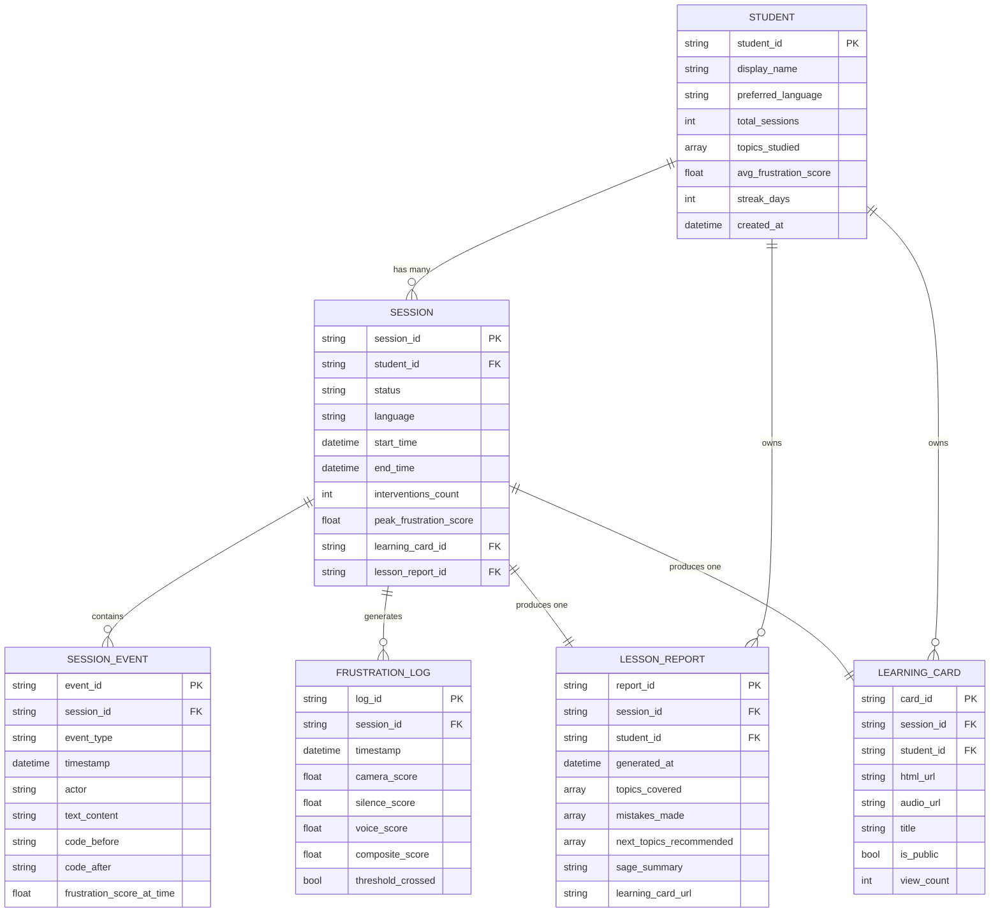

# 🔗 Entity Relationship Document (ERD)
## SAGE — Empathetic AI Pair Tutor
**Version:** 1.0 | **Date:** 2026-03-01

---

## 1. ER Diagram



---

## 2. Relationship Summary

| Relationship | Type | Description |
|---|---|---|
| STUDENT → SESSION | One-to-Many | Student has many sessions over time |
| SESSION → SESSION_EVENT | One-to-Many | Session has many events (voice, code edits) |
| SESSION → FRUSTRATION_LOG | One-to-Many | 30-second frustration score samples |
| SESSION → LESSON_REPORT | One-to-One | Each session produces exactly one report |
| SESSION → LEARNING_CARD | One-to-One | Each session produces exactly one HTML card |
| STUDENT → LESSON_REPORT | One-to-Many | Student owns all their reports |
| STUDENT → LEARNING_CARD | One-to-Many | Student owns all their learning cards |

---

## 3. Firestore Physical Map

```
firestore/
├── students/{student_id}
│   └── reports/{report_id}          ← LESSON_REPORT
├── sessions/{session_id}
│   ├── events/{event_id}            ← SESSION_EVENT
│   └── frustration_logs/{log_id}    ← FRUSTRATION_LOG
└── learning_cards/{card_id}         ← LEARNING_CARD

Cloud Storage (separate):
├── sage-cards/{card_id}.html
└── sage-audio/{card_id}.mp3
```

---

## 4. Data Volume (Hackathon Scale)

| Entity | Est. Records | Doc Size | Total |
|---|---|---|---|
| STUDENT | 50 | 1 KB | 50 KB |
| SESSION | 200 | 5 KB | 1 MB |
| SESSION_EVENT | 10,000 | 0.5 KB | 5 MB |
| FRUSTRATION_LOG | 20,000 | 0.2 KB | 4 MB |
| LESSON_REPORT | 200 | 3 KB | 0.6 MB |
| LEARNING_CARD | 200 | 0.5 KB | 0.1 MB |
| **TOTAL** | | | **~11 MB** |

Firestore free tier: 1 GiB → we use **<1%** → **$0 cost** ✅
